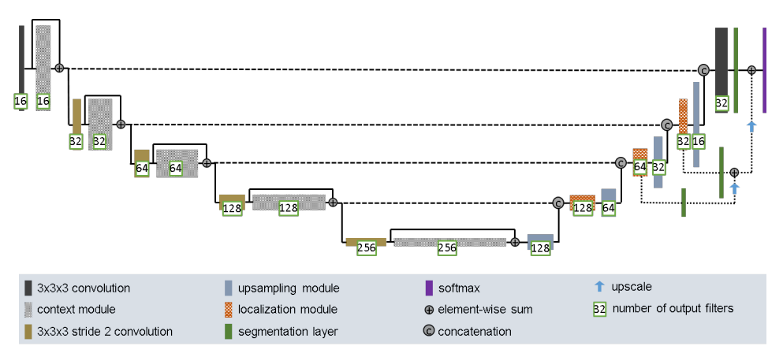

# Improved U-Net for ISIC 2018 Skin Lesion Segmentation

## Description

The Improved U-Net is a cutting-edge neural network architecture which can be tailored for biomedical image segmentation tasks. Originally inspired by the U-Net architecture, this version boasts enhancements that further optimize its accuracy and performance. The algorithm effectively addresses the problem of segmenting skin lesions from dermoscopic images, a crucial step in early skin cancer detection.

## How It Works

### Upsampling the Feature Maps:

- The first step in the localization module is to upsample the feature maps coming from the deeper layers (lower spatial resolution) to a higher spatial resolution.
- Instead of directly using a transposed convolution, the Improved U-Net often employs a simpler upscale mechanism. This could involve just doubling each pixel value or using a simple bilinear or nearest-neighbor interpolation.
- After the upscale, a 2D convolution is applied. This helps in refining the upsampled feature maps and can reduce the number of feature channels (if required).

### Concatenation with Skip Connection:

- Feature maps from the corresponding level in the downsampling pathway (or the encoder) are concatenated with the upsampled feature maps. This is the hallmark of the U-Net architecture and is referred to as a skip connection.
- The concatenated feature maps combine the high-resolution spatial details from the encoder with the high-level contextual information from the decoder.



Above is an image that showcases the localisation module in the context of processing 3 dimensional data.

## Dependencies

- **TensorFlow**: version x
- **NumPy**: version x
- **matplotlib**: version x

## Reproducibility

To ensure the reproducibility of results:
- We use fixed random seeds.
- Exact versions of all dependencies are listed.
- Training procedures, including data augmentation strategies and hyperparameters, are documented in detail.

## Example Inputs and Outputs

**Input**: 

**Output**: 

**Plot**:


## Data Pre-processing

Images were resized to 128x128 pixels for consistency. Furthermore, we applied histogram equalization to enhance the contrast of the images, ensuring better visibility of the lesions. Any artifacts or annotations present in the images were masked out to prevent interference during segmentation.

**References**:
- https://arxiv.org/pdf/1802.10508v1.pdf

## Dataset Folder Structure

```
root_directory
│
├── datasets
│   ├── isic-512
│   │   ├── resized_train
│   │   ├── resized_train_gt
│   │   ├── resized_test
│   │   ├── resized_test_gt
│   │   ├── resized_valid
│   │   └── resized_valid_gt
│
└── your_script.py
```

## Data Splits

We divided the ISIC 2018 dataset into training, validation, and test sets following an 80-10-10 split:

- **Training Data**: 80% - Used for training the network.
- **Validation Data**: 10% - Used for hyperparameter tuning and early stopping.
- **Test Data**: 10% - Held out for evaluating the final performance of the model.

This division ensures a robust assessment of the model's performance, minimising overfitting and providing a reliable estimation of its real-world applicability.
